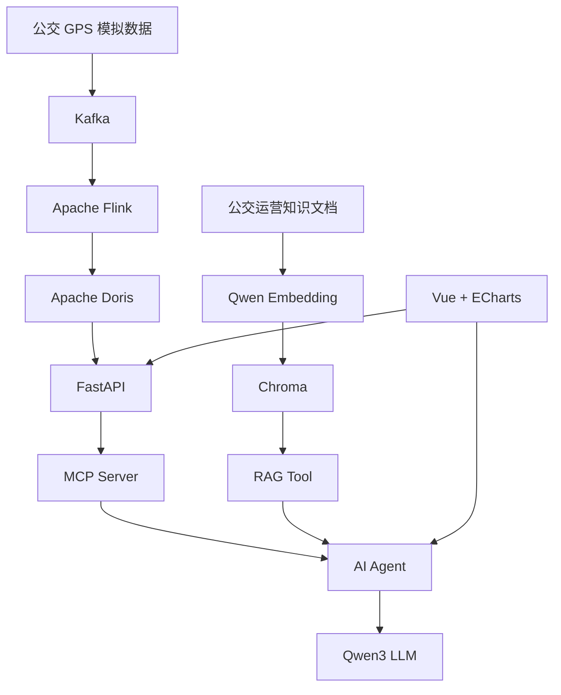

1，打开docker中的kafka
2，运行后端FastAPI    python -m uvicorn app.main:app --reload
3，运行MCP Server    python -m app.mcp_server.server
4，运行前端           npm run dev


# BUS-Agent

面向城市公交实时运行监测与智能决策的 AI Agent 平台。

BUS-Agent 将实时流式数据处理、OLAP 分析、MCP 工具调用、RAG 知识检索与大语言模型 Agent 结合，实现公交运行数据查询、运营规则检索和辅助决策，并通过 Vue + ECharts Dashboard 进行可视化展示。

---

## 1. 项目简介

传统公交运行分析通常需要分别查看实时数据平台、运营统计系统和业务规则文档。

BUS-Agent 尝试将这些能力统一到一个 AI Agent 中：

- Kafka 接收模拟公交 GPS 实时数据；
- Flink 基于 Event Time、Watermark 和时间窗口进行实时计算；
- Apache Doris 保存线路窗口聚合结果；
- FastAPI 对实时数据查询能力进行统一封装；
- MCP Server 将业务查询能力标准化暴露给 Agent；
- RAG 从公交运营规则知识库中检索相关处理规范；
- Qwen Agent 根据用户问题自动选择 MCP 或 RAG 工具；
- Vue + ECharts 展示实时指标、线路趋势及 Agent 分析结果。

项目主要用于学习和实践：

```text
实时数据处理
+
AI Agent
+
MCP
+
RAG
+
Web应用工程化
```

---

## 2. 系统架构



整体可以分成两条核心链路。

### 实时数据链路

```text
GPS Producer
    ↓
Kafka
    ↓
Flink
    ↓
Apache Doris
    ↓
FastAPI
    ↓
MCP Server
    ↓
Agent
```

主要用于回答：

```text
12路平均速度是多少？

12路最近几个时间窗口运行情况怎么样？

当前有哪些线路运行速度较低？
```

### RAG 知识链路

```text
公交运营知识文档
    ↓
文本切片
    ↓
Qwen Embedding
    ↓
Chroma
    ↓
Retriever
    ↓
RAG Tool
    ↓
Agent
```

主要用于回答：

```text
公交线路持续低速应该如何处理？

GPS数据长时间没有更新应该如何排查？

客流异常时应该采取哪些处理措施？
```

对于同时涉及实时状态和业务规则的问题：

```text
12路最近运行速度比较低，应该怎么处理？
```

Agent 会同时调用：

```text
MCP实时数据工具
+
RAG知识库工具
```

再由大语言模型综合两类结果生成回答。

---

## 3. 核心功能

### 3.1 公交 GPS 实时数据模拟

项目通过 Python Producer 模拟公交车辆运行数据，并持续写入 Kafka。

数据结构包括：

```text
vehicle_id
route_id
longitude
latitude
speed
passenger_count
timestamp
```

示例：

```json
{
  "vehicle_id": "BUS_001",
  "route_id": 12,
  "longitude": 118.78,
  "latitude": 32.04,
  "speed": 32.6,
  "passenger_count": 26,
  "timestamp": "2026-09-21T10:30:15"
}
```

Kafka Topic：

```text
bus-gps
```

通过 `vehicle_id` 作为消息 Key，使同一车辆的数据能够稳定进入对应 Partition。

---

### 3.2 Flink 实时流计算

Flink 消费 Kafka 中的公交 GPS 数据，并基于 Event Time 进行实时窗口计算。

项目中使用：

```text
Event Time
Watermark
Tumbling Window
```

当前窗口长度：

```text
30 秒
```

Watermark：

```text
最大已观察事件时间 - 10 秒
```

主要聚合指标：

```text
window_start
window_end
route_id
gps_count
avg_speed
```

处理结果写入 Apache Doris。

---

## 4. Apache Doris 实时分析

实时计算结果保存到 Doris：

```text
route_realtime_metrics
```

核心字段：

```text
window_start
route_id
window_end
gps_count
avg_speed
```

表采用：

```text
UNIQUE KEY(window_start, route_id)
```

保证同一线路、同一时间窗口对应一条逻辑统计结果。

项目中曾遇到 Flink Doris Sink 在 Docker 网络下被 FE 重定向到 `127.0.0.1:8040` 的问题。

最终通过显式指定：

```text
benodes=doris:8040
auto-redirect=false
```

解决 Flink Container 无法正确访问 Doris BE 的问题。

---

## 5. FastAPI 业务服务

FastAPI 对 Doris 查询逻辑进行统一封装。

当前主要接口：

```text
GET /api/realtime/routes
```

查询最近线路运行指标。

```text
GET /api/realtime/routes/{route_id}
```

查询某条线路最近多个时间窗口的数据。

```text
GET /api/realtime/routes/{route_id}/speed-summary
```

查询某条线路速度汇总信息。

```text
GET /api/realtime/alerts/slow-routes
```

根据指定速度阈值查询运行速度较低的线路。

```text
POST /api/agent/chat
```

向 BUS-Agent 提交自然语言问题。

Doris 查询通过独立的：

```text
doris_client.py
```

进行封装，使业务 Service 不直接处理底层 HTTP 通信细节。

---

## 6. MCP 实时业务工具

项目通过 MCP Server 将公交实时查询能力标准化提供给 Agent。

当前 MCP Tools：

```text
get_route_speed_summary
```

用于查询指定线路：

```text
平均速度
最低窗口平均速度
最高窗口平均速度
实际统计窗口数量
```

---

```text
get_route_metrics
```

用于查询指定线路最近多个时间窗口的运行明细。

---

```text
get_slow_routes
```

用于查询低于指定速度阈值的线路。

---

MCP Tool 不直接访问 Doris。

调用链为：

```text
Agent
    ↓
MCP Server
    ↓
FastAPI
    ↓
Realtime Service
    ↓
Doris Client
    ↓
Apache Doris
```

这样可以避免在 MCP Server 中重复编写 SQL 和业务逻辑。

---

## 7. RAG 公交运营知识库

项目使用本地公交运营规则构建轻量级 RAG 知识库。

当前知识文件：

```text
knowledge_base/

├── low_speed_rule.md
├── passenger_rule.md
└── gps_exception_rule.md
```

分别对应：

```text
公交低速运行处理规则
公交客流异常处理规则
公交 GPS 数据异常处理规则
```

Embedding 模型：

```text
qwen3-embedding:0.6b
```

向量数据库：

```text
Chroma
```

RAG 流程：

```text
Markdown文档
    ↓
RecursiveCharacterTextSplitter
    ↓
Qwen Embedding
    ↓
Chroma
    ↓
Retriever
    ↓
search_bus_knowledge
```

在早期测试中发现，过小的 Chunk 会导致业务规则上下文被切断。

因此后续调整切片策略，尽量保留完整业务语义单元，提高 Retriever 返回内容的完整性。

---

## 8. MCP + RAG Agent

Agent 使用本地 Ollama 模型：

```text
qwen3:1.7b
```

通过 LangChain `create_agent` 创建 Agent，并组合两类 Tool：

```text
MCP Tools
+
RAG Tool
```

当前已经验证三种工具路由方式。

### 纯实时问题

用户：

```text
12路平均速度是多少？
```

Agent：

```text
get_route_speed_summary
    ↓
MCP
    ↓
FastAPI
    ↓
Doris
```

---

### 纯知识问题

用户：

```text
GPS数据长时间没有更新应该怎么排查？
```

Agent：

```text
search_bus_knowledge
    ↓
Chroma
    ↓
gps_exception_rule.md
```

---

### MCP + RAG 综合问题

用户：

```text
12路最近运行速度比较低，应该怎么处理？
```

Agent 会同时调用：

```text
get_route_speed_summary
```

以及：

```text
search_bus_knowledge
```

实现：

```text
实时运行数据
+
公交运营规则
+
LLM综合分析
```

---

## 9. Agent Tool Trace

项目在开发和展示阶段保留 Agent 的工具调用轨迹。

例如：

```json
[
  {
    "name": "get_route_speed_summary",
    "args": {
      "route_id": 12,
      "window_limit": 10
    }
  },
  {
    "name": "search_bus_knowledge",
    "args": {
      "question": "公交线路低速应该如何处理"
    }
  }
]
```

Tool Trace 主要用于：

```text
观察 Agent 实际选择的工具
检查 Tool Calling 参数
分析工具路由是否正确
辅助定位 Agent 调用问题
Demo 展示 Agent 实际执行过程
```

生产环境中可以进一步将其转为内部日志或 Trace，而不直接展示给普通用户。

---

## 10. Agent 回答可靠性约束

为了减少大模型自由生成带来的错误，项目对 Agent 增加了多项约束。

例如：

### 区分查询上限和实际数据量

```text
window_limit = 10
```

仅代表最多查询 10 个窗口。

实际统计数量必须根据：

```text
window_count
```

确定。

不能将：

```text
window_limit=10
```

直接描述成：

```text
系统实际统计了10个窗口
```

---

### 不自行定义异常阈值

如果实时数据或知识库没有提供明确标准：

```text
33.7 km/h
```

只能作为客观数据展示。

Agent 不应该自行判断：

```text
33.7 km/h 属于异常低速
```

---

### 区分可能原因和已确认事实

知识库可能说明：

```text
道路拥堵可能导致公交运行速度下降
```

Agent 可以回答：

```text
建议进一步检查是否存在道路拥堵。
```

但不能直接回答：

```text
12路当前因为道路拥堵导致速度下降。
```

除非系统已经获得相应证据。

---

### RAG 建议必须基于知识库

Agent 可以对知识库内容进行总结和改写，但不能自行增加知识库中不存在的：

```text
调度制度
运营规则
处理流程
管理要求
```

---

## 11. Vue + ECharts Dashboard

项目使用：

```text
Vue 3
Vite
Axios
ECharts
```

实现公交智能运营 Dashboard。

当前页面包含：

```text
线路数量
最新线路平均速度
当前最低平均速度线路
GPS样本数量
线路平均速度对比图
单线路时间窗口速度趋势图
最新线路指标表格
AI运营助手
Agent Tool Trace
```

前端通过 Axios 调用 FastAPI：

```text
Vue
    ↓
FastAPI
    ↓
业务服务
```

而不会直接连接 Doris。

---

## 12. 技术栈

### 实时数据与大数据

```text
Apache Kafka
Apache Flink
Apache Doris
```

### AI / Agent

```text
LangChain
MCP
Ollama
Qwen3
Tool Calling
```

### RAG

```text
Qwen3 Embedding
Chroma
RecursiveCharacterTextSplitter
Retriever
```

### 后端

```text
Python 3.10
FastAPI
HTTPX
Pydantic
Pydantic Settings
```

### 前端

```text
Vue 3
Vite
Axios
ECharts
```

### 基础设施

```text
Docker
Docker Compose
```

---

## 13. 项目目录

```text
bus_agent/

├── app/
│   │
│   ├── agent/
│   │   ├── __init__.py
│   │   ├── mcp_agent_service.py
│   │   └── rag_tool.py
│   │
│   ├── mcp_server/
│   │   ├── __init__.py
│   │   └── server.py
│   │
│   ├── rag/
│   │   ├── __init__.py
│   │   ├── build_index.py
│   │   └── service.py
│   │
│   ├── services/
│   │   ├── __init__.py
│   │   └── realtime_service.py
│   │
│   ├── streaming/
│   │   └── ...
│   │
│   ├── __init__.py
│   ├── config.py
│   ├── doris_client.py
│   └── main.py
│
├── frontend/
│   ├── src/
│   ├── package.json
│   └── vite.config.js
│
├── infra/
│   └── kafka/
│       ├── docker-compose.yml
│       └── flink-kafka.Dockerfile
│
├── knowledge_base/
│   ├── gps_exception_rule.md
│   ├── low_speed_rule.md
│   └── passenger_rule.md
│
├── data/
│   └── chroma/
│
├── .env
├── .env.example
├── .gitignore
├── requirements.txt
└── README.md
```

其中：

```text
.env
data/chroma/
frontend/node_modules/
```

属于本地运行环境或可重新生成的数据，不建议提交 Git。

---

## 14. 环境配置

项目使用统一配置：

```text
.env
    ↓
app/config.py
    ↓
各业务模块
```

示例：

```env
API_BASE_URL=http://127.0.0.1:8000

MCP_URL=http://127.0.0.1:8001/mcp

OLLAMA_BASE_URL=http://127.0.0.1:11434
OLLAMA_CHAT_MODEL=qwen3:1.7b
OLLAMA_EMBEDDING_MODEL=qwen3-embedding:0.6b

DORIS_URL=http://127.0.0.1:8030
DORIS_DATABASE=bus_agent
DORIS_USER=root
DORIS_PASSWORD=
```

项目同时保留：

```text
.env.example
```

用于说明运行项目所需的环境变量。

---

## 15. 本地运行

### 15.1 Python 环境

推荐：

```text
Python 3.10
```

安装依赖：

```bash
pip install -r requirements.txt
```

---

### 15.2 Ollama 模型

需要准备：

```text
qwen3:1.7b
qwen3-embedding:0.6b
```

检查模型：

```bash
ollama list
```

---

### 15.3 启动基础设施

进入：

```bash
cd infra/kafka
```

启动 Docker 服务：

```bash
docker compose up -d
```

确保项目需要的 Kafka、Flink 和 Doris 服务正常运行。

---

### 15.4 构建 RAG 索引

首次运行或者知识文档修改后执行：

```bash
python -m app.rag.build_index
```

生成的 Chroma 数据默认位于：

```text
data/chroma
```

---

### 15.5 启动 FastAPI

在项目根目录执行：

```bash
python -m uvicorn app.main:app --reload
```

FastAPI：

```text
http://127.0.0.1:8000
```

Swagger：

```text
http://127.0.0.1:8000/docs
```

---

### 15.6 启动 MCP Server

新开一个终端：

```bash
python -m app.mcp_server.server
```

MCP Endpoint：

```text
http://127.0.0.1:8001/mcp
```

---

### 15.7 启动 Vue 前端

进入：

```bash
cd frontend
```

首次运行：

```bash
npm install
```

启动：

```bash
npm run dev
```

访问：

```text
http://localhost:5173
```

---

## 16. Agent 使用示例

### 查询线路速度

```text
12路平均速度是多少？
```

预期：

```text
MCP
→ get_route_speed_summary
```

---

### 查询历史窗口

```text
12路最近几个时间窗口运行怎么样？
```

预期：

```text
MCP
→ get_route_metrics
```

---

### 查询全局低速线路

```text
当前有没有运行比较慢的线路？
```

预期：

```text
MCP
→ get_slow_routes
```

---

### 查询业务知识

```text
GPS数据长时间没有更新应该怎么排查？
```

预期：

```text
RAG
→ search_bus_knowledge
```

---

### 综合分析

```text
12路最近运行速度比较低，应该怎么处理？
```

预期：

```text
MCP
→ get_route_speed_summary

+

RAG
→ search_bus_knowledge
```

最终由 Agent 综合实时数据与业务规则生成回答。

---

## 17. 项目设计思路

### 为什么实时数据不用 RAG？

实时速度、GPS数量、时间窗口指标属于持续变化的结构化数据。

这类数据适合：

```text
Doris
+
SQL
+
FastAPI
+
MCP
```

进行精确查询。

RAG 更适合：

```text
运营规则
处理规范
调度知识
业务文档
```

等相对稳定的非结构化知识。

---

### 为什么 MCP Tool 不直接访问 Doris？

Doris 查询和业务逻辑已经统一封装在 FastAPI Service 中。

如果 MCP 再直接写 SQL，会出现：

```text
业务逻辑重复
SQL重复
维护成本增加
接口行为不一致
```

因此项目采用：

```text
Agent
    ↓
MCP Server
    ↓
FastAPI
    ↓
Service
    ↓
Doris
```

Web 页面、Agent 以及未来其他客户端可以共享同一套业务能力。

---

### 为什么 RAG Tool 当前不经过 MCP？

当前 Chroma 属于 Agent 本地知识能力，没有独立服务化和跨系统共享需求。

因此采用：

```text
Agent
    ↓
RAG Tool
    ↓
RAG Service
    ↓
Chroma
```

可以保持结构简单。

如果未来知识库独立部署，也可以进一步通过 MCP 将 RAG 能力标准化暴露出去。

---

### 为什么保留 Agent Tool Trace？

Agent 最终回答由大模型生成，仅查看最终文字很难判断：

```text
模型到底调用了哪个Tool？
参数是什么？
有没有同时调用MCP和RAG？
```

因此项目在开发阶段保留：

```text
tools_used
```

用于观察 Agent 实际调用轨迹。

---

### 为什么前端不直接访问 Doris？

浏览器不应直接连接数据库。

项目通过：

```text
Vue
    ↓
FastAPI
    ↓
Doris
```

进行访问，可以统一实现：

```text
业务逻辑
参数校验
异常处理
权限扩展
接口管理
```

同时降低前端与数据库之间的耦合。

---

## 18. 项目中遇到的问题

### Flink → Doris Docker 网络问题

最初 Flink Doris Sink 连接 FE 后，FE 将请求重定向到：

```text
127.0.0.1:8040
```

但对于 Flink Container：

```text
127.0.0.1
```

表示 Flink Container 自身，而不是 Doris BE。

最终通过显式配置：

```text
benodes=doris:8040
auto-redirect=false
```

解决问题。

---

### RAG Chunk 过小导致上下文断裂

初始使用较小 Chunk 后发现：

```text
标题
处理规则
上下文
```

可能被切到不同 Chunk 中。

虽然 Retriever 找到了正确文件，但返回内容语义不完整。

后续调整：

```text
Chunk Size
Chunk Overlap
知识文档结构
```

尽量保证完整业务语义单元。

---

### Agent 将查询参数误认为实际数据量

例如：

```text
window_limit=10
```

模型曾错误表述为：

```text
最近10个窗口
```

但数据库实际可能只存在：

```text
window_count=9
```

因此后续在 Agent Prompt 中明确要求：

```text
window_limit
只是最大查询数量

window_count
才是实际统计数量
```

---

### RAG 正确但回答仍可能产生幻觉

Retriever 能够找到正确规则，并不意味着最终 LLM 一定完全忠实于知识库。

因此项目增加约束：

```text
业务建议必须来自RAG返回内容

不能将可能原因描述成已确认事实

不能自行增加知识库中不存在的运营规则
```

---

## 19. 当前项目状态

当前已经完成：

```text
Kafka GPS数据流
        ↓
Flink实时窗口计算
        ↓
Doris实时分析
        ↓
FastAPI业务API
        ↓
MCP Tool
        ↓
Qwen Agent
```

以及：

```text
公交知识文档
        ↓
Embedding
        ↓
Chroma
        ↓
RAG Tool
        ↓
Qwen Agent
```

最终形成：

```text
实时数据
+
企业知识
+
AI Agent
+
Web Dashboard
```

的完整闭环。

---

## 20. 当前定位与后续方向

BUS-Agent 当前定位为：

> 面向学习、求职展示和 AI 应用工程实践的本地城市公交智能运营原型。

当前重点是验证：

```text
实时流式数据处理
MCP工具标准化
RAG知识增强
Agent工具路由
前后端完整闭环
```

暂未将项目描述为生产级系统，也未进行大规模并发、完整权限体系和生产环境性能压测。

后续可以继续扩展：

```text
更多公交业务指标
更多运营知识文档
Agent会话历史
用户权限体系
工具调用日志
服务监控
Docker化应用层
知识库增量更新
更多业务MCP Tools
```

---

## 21. 项目总结

BUS-Agent 将传统实时数据平台与大语言模型 Agent 结合。

项目不仅让大模型能够：

```text
“回答问题”
```

还让它能够：

```text
查询实时业务数据
检索运营知识
调用标准化工具
组合多种信息进行分析
```

完整流程：

```text
实时数据
    ↓
Kafka
    ↓
Flink
    ↓
Doris
    ↓
FastAPI
    ↓
MCP
       \
        \
         → AI Agent → 用户
        /
       /
RAG ← Chroma ← 公交知识库
```

项目重点不是单纯调用大模型 API，而是实践：

```text
数据工程
+
业务服务
+
MCP
+
RAG
+
Agent
+
前端展示
```

之间的完整工程协作。